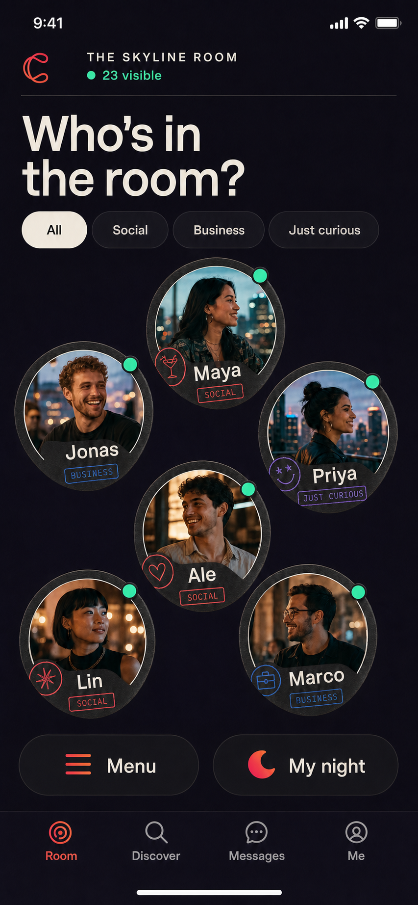
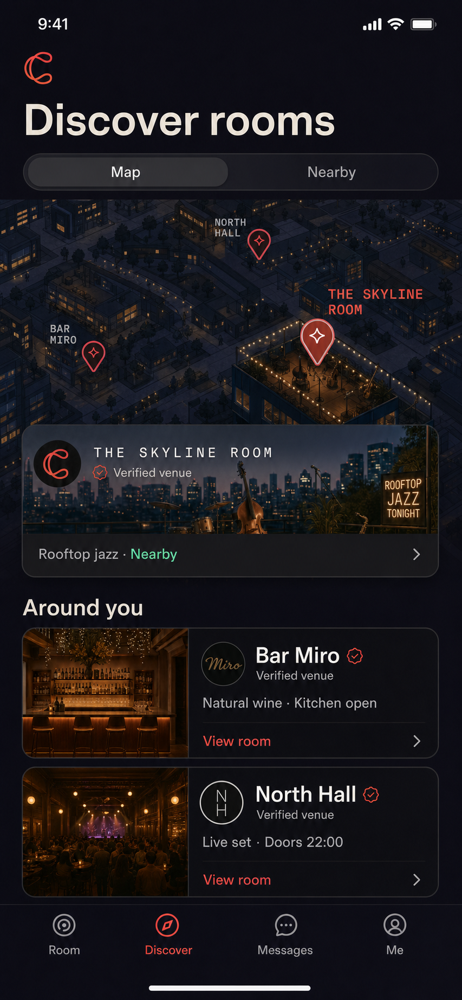
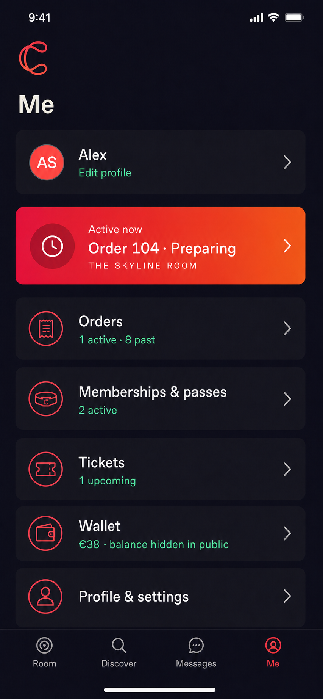

# Crays Mobile — Product Requirements Document

**Status:** Product concept 
**Platform:** React Native for iOS and Android 
**Working name:** `crays-rn` 
**Date:** 2026-08-02

> Crays is the social layer of real places: meet the people in the room, talk privately, order from the venue, and carry the tickets, passes, and memberships that make the night work.

## 1. Product summary

Crays Mobile is a place-first Nostr app for hospitality and events. It replaces the global, infinite social feed with a contextual experience centered on the venue the person is physically visiting.

A participating venue advertises a signed room descriptor and short-lived access challenge over Bluetooth. Crays discovers it, asks the person to join, and connects to the venue's Nostr relay. Inside that room, the person can:

- see people who have deliberately made themselves visible;
- read and post to a feed that belongs only to that place;
- send a low-pressure message request or buy someone a drink;
- order from the venue menu for themselves;
- buy someone in the room a drink;
- join an event, present a ticket, or use a pass;
- track current and past orders, including receipts and support;
- understand, use, and manage memberships and remaining benefits.

When the person leaves, the live room and its feed lock. Direct messages, purchased items, passes, memberships, and tickets remain available.

### Product thesis

Most social apps show people who are somewhere else. Crays helps with the room a person is already in.

### The memorable loop

**Walk in → join the room → notice someone → message or send a drink → talk → meet.**

Commerce and access are not separate utilities bolted onto the social product. They give people natural reasons to interact and give the venue a reason to run the room.

## 2. Evidence and product lineage

This PRD is based on:

- the current [Crays website](https://crays.life), including “Meet the people in the room,” “First contact, zero awkward,” and “Order, book, pay — without leaving the moment”;
- the existing `/root/code/crays` repository and its Crays brand system;
- the hospitality admin surfaces in `/root/code/crays/src/routes/admin` and `/root/code/nuts-cash/src/routes/admin`;
- the member-side commerce, event, invite, and entitlement work in `/root/code/nuts-rn`.

There is no `/root/code/nuts` checkout on the host used for this PRD. `/root/code/nuts-cash` was treated as the intended staff/admin reference.

## 3. Product principles

1. **The room comes first.** The default social context is the place a person has intentionally joined, not a global algorithmic timeline.
2. **Presence is volunteered, not inferred.** Bluetooth discovers a venue. It does not publish a person, reveal exact distance, or continuously track them.
3. **First contact should feel light and familiar.** A short message request or a non-anonymous drink is easier to understand than a branded social gesture.
4. **Private conversation outlives the room.** The room is temporary; relationships belong to the people involved.
5. **The venue runs one operational truth.** Mobile orders, tickets, memberships, and passes must match the existing Crays/Nuts admin data and status flows.
6. **Protocols stay backstage.** Nostr, relays, Cashu, and signed events provide ownership and interoperability, but the primary UI speaks about rooms, people, tickets, drinks, and messages.
7. **Leaving must be real.** Live presence ends, posting locks, and the place feed is no longer browseable when proximity proof expires.
8. **The night is temporary; the relationship is durable.** My night prioritizes what is useful right now. Orders, receipts, tickets, passes, and memberships keep a stable home after the person leaves.
9. **Nostr underneath; familiar access on top.** A Nostr public key is the durable identity. Apple, Google, passkeys, and device unlock may create or recover access without pretending that the identity belongs to those providers.
10. **Bitcoin is a payment rail, not the product personality.** The embedded Cashu wallet should feel like a fast venue wallet. Bitcoin, sats, mints, and Nostr sync appear only where they help the user understand or control their money.

## 4. Users and jobs

### Guest or regular

At a bar, café, restaurant, club, hotel, coworking lounge, gym, or event, the guest wants to understand what is happening, meet people without a cold approach, order without breaking the moment, track what they bought, and find their ticket or pass quickly.

### Event attendee

The attendee wants to discover the room, see who else is attending, enter with a reliable QR, and keep conversations made there.

### Venue regular or member

The regular wants one place to understand membership value, status, renewal, benefits, passes, remaining uses, receipts, events, and their ongoing relationship with the venue.

### Venue staff and operator

Staff do not use this mobile app to run operations. They continue using the Crays/Nuts admin software for People, Events, Store/Menu, Orders, Invites, roles, payments, and settings. The mobile product is the guest side of those same objects.

## 5. Scope

### MVP

- Intent-aware entry for cold signup, invite redemption, and returning-user login.
- Nostr identity creation, Apple/Google access *(deferred from the pilot build — see D-008 in `docs/DESIGN-DEBT.md`)*, device unlock, recovery/import, and a minimal profile without protocol jargon.
- Foreground Bluetooth discovery of nearby Crays rooms.
- Signed venue verification and explicit join/leave.
- Venue-scoped presence with visibility and intent controls.
- People view and consent-aware message requests.
- Room-locked feed with operator and guest posts.
- Encrypted direct messages.
- Venue menu, self-order, and order status.
- Active order tracking, order history, receipts, recovery, cancellation/refund status, and venue support paths.
- Embedded Cashu wallet with Nostr-backed encrypted state, Bitcoin/Lightning funding, venue payment, receiving, activity, recovery, and discreet advanced controls. *(Deferred from the pilot build — see D-006 and D-007 in `docs/DESIGN-DEBT.md`.)*
- “Send a drink” from a profile or conversation.
- Venue events, RSVP, capacity messaging, and entry ticket.
- Membership discovery, detail, benefits, status, renewal/payment action, multi-use passes, remaining uses, activity, and presentation QR.
- Notifications for message requests, replies, gifted items, orders, tickets, and passes. *(Deferred from the pilot build — see D-009 in `docs/DESIGN-DEBT.md`.)*
- Blocking, reporting, venue moderation, and emergency leave controls.

### Explicit non-goals

- A global or algorithmic feed.
- Public follower-growth mechanics, influencer tools, or engagement streaks.
- Exact indoor location, distance-to-person, or a floor-plan tracker.
- Staff order management in the mobile app.
- Anonymous drink gifts.
- Dating matching, swiping, popularity scores, or “hot or not” mechanics.
- Claiming that room-locked content is copy-proof or screenshot-proof.

## 6. Information architecture

### Core entity model

Crays has no separate Place container. **Room**, **place**, and **relay** refer to the same product entity at different levels of language:

- **Relay** — the technical Nostr endpoint and authority;
- **Room** — the primary in-app term for entering and participating;
- **Place** — occasional natural-language copy for a restaurant, club, event space, or community, never a separate stored object.

One restaurant, club, or community is one relay. A physical complex with five independent restaurants may expose five nearby rooms/relays. Crays does not group them under a parent Place object unless a future Nostr-native relationship model is explicitly designed.

The compact-width app has four primary destinations:

| Destination | Purpose |
| --- | --- |
| **Room** | The one currently selected relay: People, Room feed, menu, My night, and leave. Before selection, this routes to Discover. |
| **Discover** | Find relays on a map or through nearby Bluetooth highlights, inspect them, and choose one to enter. |
| **Messages** | Encrypted conversations and message requests. This remains useful after leaving. |
| **Me** | Profile, privacy, orders, tickets, passes, memberships, payment methods, keys, and settings. |

Exactly one room relay may be active at a time. Room-scoped subscriptions, presence, feed, menu, events, and live room UI all derive from that selected relay. Messages and durable objects in Me remain available across relay changes.

This single-selection rule applies to **room relays**, not every infrastructure connection. The client may simultaneously use the Crays search relay for discovery, the user's configured relays for identity/messages/wallet sync, and exactly one selected room relay for the live experience.

### Active-room navigation

Within **Room**, the relay/room header remains pinned and shows connection state. The primary switch is:

- **People** — visible guests and staff who opted in;
- **Room feed** — posts from this venue session.

The header also exposes **Menu**, **My night**, and **Leave room** through direct actions or a compact venue sheet. Menu is never buried under profile settings.

### My night versus Me

**My night** is a contextual, room-ready surface, not the user's archive. It shows only what is actionable now: the next entry credential, active orders, relevant membership benefits, and passes that can be used in the active room. It is reachable from Room and may also appear as the first contextual card in Me.

**Me** is the durable account home. Its first level is ordered by user urgency rather than implementation type:

1. **Active now** — entry credential, active orders, or action-needed membership when relevant;
2. **Orders** — active and past orders, receipts, refunds, and support;
3. **Memberships & passes** — status, benefits, remaining uses, activity, renewal, and payment action;
4. **Tickets** — upcoming and past event access;
5. **Wallet** — balance visibility, add/receive funds, activity, recovery state, and advanced Bitcoin/Cashu details;
6. **Profile & settings** — identity, linked Apple/Google access, privacy, other payment methods, recovery, notifications, blocks, and app settings.

Acquisition belongs to the relay: a person finds a menu, event, or membership offer after entering it or from its Discover preview. Tracking and presentation belong to My night while they are timely. History and management belong to Me. The app must not make a person remember this model; every successful purchase or redemption links directly to its durable record.

### Before a relay is selected

Discover is the gateway. It offers:

- **Map** — browse or search relay entries geographically, without requiring the person to be physically nearby;
- **Nearby** — rooms whose signed highlight/manifest is currently discoverable over Bluetooth;
- **QR or link** — open a specific relay preview directly.

Before selection, no room feed, people roster, venue menu, or relay-scoped presence is active. Global Messages and Me may remain reachable for returning users, but the primary empty state is Discover.

## 7. Core experiences

### 7.0 Entry and onboarding architecture

Crays has three entry intents, but it must not present them as three equally weighted choices on every launch. An entry router resolves session state and incoming context before choosing the first screen.

| Entry | First promise | Primary action | Successful destination |
| --- | --- | --- | --- |
| **Cold signup** | Discover and enter a room, with privacy under your control. | **Create account** | Discover or the preserved relay preview; never a generic tutorial carousel. |
| **Invite redemption** | Show exactly who invited the person, to which venue/event/membership, what they receive, and whether it expires. | **Accept invite** | The invited venue, event, membership, or join confirmation. |
| **Returning login** | Restore the person's existing Crays identity and durable items. | **Log in** or device unlock | The interrupted intent, urgent active item, or last safe destination. |

**Create account** is primary on a cold launch and **Log in** is a quiet secondary action. A valid invite deep link bypasses the generic welcome and opens the invite preview directly. A recognized local identity bypasses cold education.

#### Cold signup

1. Show one concise value screen with **Create account** and secondary **Log in**. Do not request Bluetooth, contacts, notifications, camera, or location here.
2. Offer **Continue with Apple**, **Continue with Google**, and **Create on this device**. Each path creates or restores access to a Nostr identity; the provider account is not itself the user's social identity.
3. Ask only for a display name. Photo, bio, intents, and one-line room context remain optional until they become useful.
4. Explain recovery in one focused step and confirm whether the account is recoverable before the person purchases durable items. Never expose raw key material by surprise.
5. Land in the preserved context. If there is no context, show Discover with Map and Nearby before any just-in-time Bluetooth permission request.
6. Ask for notification permission only after demonstrating a concrete reason, such as an active order, message request, event reminder, or expiring membership.

Onboarding teaches through the first useful action. It does not front-load a carousel about messaging, Nostr, relays, tickets, membership, and ordering.

#### Invite redemption

1. Validate the invite without consuming it and persist the signed invite plus destination before authentication.
2. Show issuer, venue, event or membership, benefit/access granted, expiry, price if any, and any eligibility requirement.
3. Let a returning person log in or a new person create an account without losing the invite preview.
4. Redeem idempotently. App switching, connectivity loss, repeated taps, and relaunch must not create duplicate membership, ticket, or role records.
5. Confirm the outcome in user language, then open the exact object that was granted.
6. If the invite points to a live room and valid proximity proof is available, continue to **Join room**. Invite redemption never silently publishes presence; visibility is still a separate choice.
7. If the person is not physically present, save the venue or entitlement and explain when and where it can be used.

#### Returning login and recovery

1. Prefer fast device unlock when the identity is already present. Otherwise offer **Continue with Apple**, **Continue with Google**, and **Other ways to log in**.
2. After authentication, restore the original deep link, invite, checkout, QR, order, or membership action rather than opening a generic home screen.
3. Put key import, remote signer, and recovery alternatives behind **Other ways to log in** unless one is already configured.
4. If two identities could claim the same invite or purchase, stop before redemption and explain which account will own it.
5. Never merge identities, move entitlements, or overwrite a local key silently.

#### Identity and provider boundary

- The Nostr public key is the stable account identifier across devices and providers.
- Apple or Google may authenticate access to encrypted recovery material or an approved signing service, but Crays must not derive a different Nostr identity on each provider/device.
- Linking or unlinking a provider requires proof from the active Nostr identity and recent provider authentication.
- The user can inspect their Nostr identity, export or migrate it where the chosen custody model permits, or connect a remote signer from an advanced account screen.
- Loss of Apple/Google access must not be described as loss of the Nostr identity when another configured recovery path exists.
- The product must disclose the custody/recovery consequence before the user stores money or purchases durable entitlements.

#### Entry requirements

- Entry context survives authentication, OS permission sheets, payment handoff, app backgrounding, and relaunch.
- Back always returns to the meaningful previous context; cancel leaves the invite or venue preview recoverable.
- The user can inspect invite legitimacy and venue identity before account creation.
- Account creation, login, and recovery have explicit loading, success, offline, cancelled, expired, and retry states.
- Underage or ineligible users may still use non-restricted parts of Crays; restrictions are applied to the relevant item or event, not disguised as generic onboarding failure.

### 7.1 Discover and choose a room

Rooms highlight themselves in Discover. A highlight is signed by the same identity that controls the relay metadata and may include:

- room name, hero image, and one-line reason to enter;
- category such as restaurant, club, event space, or community;
- current event or operational highlight;
- capabilities such as menu, tickets, membership, or social room;
- open/closed state and a neutral **Nearby** label when found over Bluetooth;
- visible-person count only when it represents opted-in visible profiles.

Map and Bluetooth results resolve to the same relay entity and open the same preview. Bluetooth does not create a second nearby-only room record.

Map, text, and category discovery query the Crays search relay. Nearby Bluetooth may resolve a compact room identifier through the same search relay, but a directly readable signed manifest and QR/deep link remain usable when search is unavailable.

When several relays are nearby, show a scannable list or map cluster of signed room cards. Do not auto-select the strongest beacon, rank by popularity, or imply exact distance. The person explicitly chooses **Enter room**.

If another relay is already active, selecting a new room opens a switch confirmation:

- name the current and destination rooms;
- explain that presence and feed access in the current room will end;
- retain messages, active orders, tickets, passes, memberships, and wallet state;
- require **Leave and enter new room** before changing relay subscriptions;
- return safely to the current room on cancel or failed destination connection.

There is never more than one active room relay. Background discovery may update the Nearby list, but it does not subscribe to multiple room feeds or publish presence to multiple relays.

### 7.2 Join a room

1. The person opens a room preview from Discover, Bluetooth, QR, link, or invite.
2. Crays explains that Bluetooth finds participating rooms nearby and does not publish presence.
3. The person grants Bluetooth/Nearby Devices permission.
4. A signed venue card appears with name, image, current event, and what joining shares.
5. The person chooses **Join room**.
6. The app connects and authenticates to the advertised Nostr relay.
7. Before becoming visible, the person chooses:
   - visibility: **Visible** or **Browse quietly**;
   - intent: **Social**, **Business**, **Dating**, or **Just curious**;
   - optional one-line context, such as “Here for the jazz set”;
   - an automatic leave time.
8. Room opens on People. A persistent state reads **Connected in the room**.

Joining a relay never silently publishes visibility. Browse quietly remains a valid full-product state: the person can read venue announcements, order, and use a ticket without appearing to others.

The pre-join action is always **Join room**. After joining, the header always says **Connected in the room** and exposes People/Room feed, Menu, My night, and Leave consistently. **I'm here** is not used as an ambiguous join/visibility action.

### 7.3 People in the room

The People view is an organic constellation rather than a ranking. It may visually echo coasters on a table, but must preserve predictable reading order and accessibility semantics.

Each visible person shows only:

- chosen first/display name and avatar;
- chosen intent;
- optional one-line context;
- a live presence dot;
- mutual context when useful, such as a shared contact or shared event.

It does not show exact distance, table number, last active time outside the room, follower count, or a popularity score.

Filters affect only the local view. There is no public count of how often someone is opened or messaged.

### 7.4 Message requests and first contact

Crays uses a familiar message-request model rather than a branded first-contact mechanic.

- The sender writes one short message of up to 240 characters. Situational starters may be offered, but the result is always an ordinary editable message.
- The recipient sees the sender's room profile and the full message, and can **Accept**, **Reply**, **Not now**, **Block**, or **Report**.
- Until the recipient accepts or replies, the sender cannot send another message, a drink, or repeated prompts to the same person.
- A recipient can limit requests to mutual contacts, selected intents, or nobody.
- Rate limits apply per sender, recipient, and room. Repeated ignored requests are suppressed.
- Existing contacts and accepted conversations open directly as encrypted message threads and persist after both people leave.
- A non-anonymous drink may be used as first contact only when venue and recipient settings allow it. The recipient can decline without opening a conversation.

The UI may offer editable starters such as “What are you drinking?” and “How do you know this place?” They should feel situational, not scripted as pickup lines. The primary labels remain **Message** and **Send a drink**.

### 7.5 Room-locked feed

The Room feed is the only feed in Crays Mobile.

- It belongs to the one currently selected room relay.
- Live read and write access require a valid, recent room credential.
- Venue announcements, event updates, questions, photos, and lightweight social posts share one chronological stream.
- Posts identify the venue context clearly.
- The default view is concise: no engagement leaderboard, repost race, or recommendation algorithm.
- Available actions are reply, message request, report, and open an existing private conversation when allowed.
- Venue operators can pin one operational announcement, such as a stage time or kitchen closure.
- Guests can choose whether a room post may be saved to their own device.

#### Locking behavior

When proximity proof expires:

- new room posts stop loading;
- compose, reactions, and replies lock immediately;
- the screen changes to a clear **Room ended** state;
- private messages remain;
- the person's own room posts remain available in a private activity log only if they opted to save them;
- venue-issued orders, passes, tickets, and memberships remain available.

“Room-locked” is an access and product rule, not DRM. A person who saw a post can still remember, copy, photograph, or republish it. The onboarding copy must say that plainly without making the experience alarming.

### 7.6 Order from the room

The active venue exposes its admin-managed menu/catalog. Hospitality venues use section-first navigation such as Cocktails, Wine, Food, and Soft drinks.

The order flow is:

1. Open Menu from the room header.
2. Choose an available item and quantity.
3. Choose **For me** or **Send to someone**.
4. Confirm fulfillment location only when the venue needs it, such as a table number or pickup point.
5. Pay with any venue-configured method: **Wallet**, Apple Pay, Google Pay, or card through Stripe/another processor. Wallet can be funded over Lightning when needed. No method is forced merely because it is built into Crays.
6. Receive live status: **Sent**, **Accepted**, **Preparing**, **Ready**, **Served**, or **Cancelled**.

The mobile labels map to the existing admin order ladder: `pending → accepted → processing → ready → fulfilled`, with `cancelled` as the terminal failure state.

#### Order surfaces and ownership

The order journey is one connected system:

1. **Menu** — sections, availability, dietary/service information, and venue context;
2. **Item** — modifiers, quantity, price changes, and fulfillment constraints;
3. **Cart** — items, taxes/fees, tip when applicable, fulfillment point, and editable total;
4. **Review and pay** — payment method, final fiat amount plus sats equivalent when Wallet is selected, cancellation/refund policy, and a CTA that states the commitment, such as **Place order · €24**;
5. **Confirmation** — venue, order number, paid amount, expected next state, and **Track order**;
6. **Live order detail** — item list, status timeline, pickup/table instructions, venue support, cancellation when allowed, and refund state;
7. **Receipt** — settled total, payment reference, timestamps, tax/merchant details where required, and share/export;
8. **Order history** — active first, then past orders grouped by date and venue, with search/filter only when volume justifies it.

Active orders appear in My night and as a contextual card in Me. Every order remains under **Me → Orders** after it is served, cancelled, or refunded. A single order detail component handles self-orders and gifts, clearly separating purchaser, recipient, message delivery, recipient acceptance, and venue fulfillment.

**Delivered** is reserved for message delivery and must not label a bar order. User-visible commerce states use only **Sent, Accepted, Preparing, Ready, Served, Cancelled**, plus **Refund pending** and **Refunded** when applicable.

If payment completes but order creation is uncertain, show **Confirming with the venue** and reconcile from the payment/venue reference. Never show a second pay action until reconciliation proves the first attempt failed.

### 7.7 Send someone a drink

**Send a drink** is available from a visible room profile and an established direct conversation.

1. Crays opens the current venue's eligible drink catalog.
2. The sender chooses an item and pays.
3. The venue receives a normal order with the recipient attached.
4. The recipient receives an encrypted message and a claim/presentation ticket.
5. The order progresses through the same kitchen/bar status flow.

Rules:

- The recipient must be a known Nostr identity currently in the room or an existing contact.
- The gift is never anonymous.
- The recipient can decline before fulfillment.
- Declining does not disclose their table or precise position.
- Refund behavior follows the venue's configured payment policy.
- Alcoholic items respect venue and jurisdiction rules; the venue remains responsible for age and service checks.

The feature should read as a social gesture, not a cash transfer. The primary copy is: **The bar gets the order. Maya gets the ticket.**

### 7.8 Events and entry

The room preview and active room show events created by its staff. An event may be free, RSVP-only, capacity-gated, membership-gated, or paid.

Guests can:

- view time, location, host, capacity, and access requirements;
- RSVP going, interested, or declined;
- purchase an entrance entitlement when required;
- open **My night** from Room or Me;
- present a short-lived signed QR at the door;
- see successful entry and any remaining event privileges.

The QR always sits on a pure white card for scanner contrast, regardless of theme. It refreshes automatically and exposes no Nostr implementation details.

### 7.9 Memberships and passes

Memberships and multi-use passes are first-class objects in Me and on the relay's Discover preview.

Each item shows:

- issuer/venue;
- status: active, exhausted, expired, revoked, or action needed;
- validity period;
- remaining uses when finite;
- benefits or access scope;
- a live presentation QR;
- fulfillment activity, such as check-ins or redeemed drinks.

At-venue access must be reachable in two taps from a cold open when a relevant entitlement exists.

Membership is an ongoing venue relationship, not only an entitlement row. The product needs four coordinated surfaces:

- **Venue membership offer** — name, price and cadence, concrete benefits, eligibility, start date, renewal behavior, cancellation terms, and comparison when multiple tiers exist;
- **Membership detail** — explicit status, validity, member identity, benefits available now, benefit usage/activity, presentation QR when required, venue contact, terms, and payment/renewal management;
- **My night** — only the membership benefits and access relevant at the current venue right now;
- **Me → Memberships & passes** — active items first, then action needed, upcoming expiry, and inactive history.

User-visible membership states are **Active, Action needed, Paused, Expires soon, Expired, Revoked**, and **Cancelled**. Finite passes additionally use **Available, Exhausted**, and remaining-use counts. Status must be written in text and never inferred only from color or a date.

Renewal and payment behavior must say whether the membership renews automatically, the next amount/date, the payment method, and what happens when payment fails. Cancellation explains the effective end date before confirmation and does not use guilt or obstruction. Invite-granted membership follows the same detail and activity model as purchased membership and identifies its issuer.

Benefit activity is a ledger of meaningful uses, not a loyalty engagement feed. Each entry states the benefit, venue, time, and remaining balance when relevant. Staff fulfillment updates the same underlying object; mobile never maintains a competing counter.

### 7.10 Leaving

The person can leave explicitly at any time. Crays also ends presence after the selected time or when the short-lived proximity credential can no longer be renewed.

Leaving:

- removes the person from the live room roster after a brief network tolerance window;
- locks the feed;
- stops Bluetooth scanning unless the person returns to Discover/Nearby;
- retains DMs, orders, tickets, passes, memberships, receipts, blocks, and reports;
- never sends a social “left the room” announcement.

### 7.11 Embedded wallet and Bitcoin payments

Crays includes a Cashu wallet whose encrypted wallet state can synchronize through the user's Nostr identity. The implementation should follow the current Cashu Wallet and Nutzap interoperability standards where compatible. The product calls it **Wallet** in primary UI.

#### Placement

- Wallet is not a fifth primary tab and does not compete with the room, messages, or memberships.
- Checkout shows **Wallet** alongside the venue's configured Apple Pay, Google Pay, and card methods. Wallet displays the spendable balance or a balance-hidden state.
- Me contains a quiet **Wallet** row and wallet detail screen.
- Advanced details identify Bitcoin, Cashu, selected mints, Nostr sync/recovery status, token state, and interoperability options.

#### Wallet detail

The default wallet surface shows:

- balance in the user's preferred fiat currency, with sats available as a secondary or toggled value;
- **Add funds**, **Receive**, and activity;
- pending incoming/outgoing operations;
- recovery/sync health in plain language;
- a discreet link to Bitcoin/Cashu details.

The wallet may receive Lightning payments, Cashu tokens, and compatible Nostr-native ecash transfers. Sending outside the venue checkout is available from wallet detail, not promoted in the primary app navigation.

#### Payment behavior

1. Checkout prices remain anchored in the venue's configured currency.
2. Default to the person's last successful or explicitly preferred available method, not automatically to Wallet. Changing payment method is one tap from review.
3. When Wallet is chosen, show the sats equivalent and quote expiry without making the person calculate exchange rates.
4. Reserve or spend proofs exactly once. App closure, relay lag, mint timeout, and venue-order uncertainty must never present the same funds as safely spendable twice.
5. A successful payment and failed order creation enters **Confirming with the venue**, using one reconciliation contract across Wallet and Stripe-backed methods.
6. Refunds return through the original rail when possible and explain any exception; they never silently move value between Wallet, card, or Lightning.
7. Mint trust and recoverability are explained before the first substantial funding action, not as a protocol wall during a small checkout.

Stripe is implementation infrastructure, not a primary user-facing payment label. Checkout says **Apple Pay**, **Google Pay**, or **Card**; receipts/support details may identify the processor and payment reference where useful or required.

#### Nostr wallet layer

- Nostr carries encrypted wallet configuration, proofs/state, history, and recovery/sync events according to the supported wallet standard.
- Nostr relays are synchronization infrastructure, not the issuer of the money. Cashu mints remain the issuers and trust boundary.
- A local database remains the immediate operational state; Nostr sync is encrypted backup/interoperability and must handle stale, duplicate, and conflicting events defensively.
- Public profiles, room relays, and venue operators never receive the user's wallet balance or token inventory.

## 8. Bluetooth room discovery and relay access

### Crays search relay

Crays needs a dedicated search relay that indexes discoverable room relays. It is discovery infrastructure, not a room that the person enters.

Room operators publish signed, expiring discovery records to the Crays search relay. A record contains or references:

- room identity/public key and room relay URL;
- display name, hero image, category, and one-line highlight;
- map coordinates or the approved geographic index representation;
- current event/operational highlight and expiry;
- supported capabilities such as menu, tickets, membership, social presence, and Bluetooth discovery;
- metadata/manifest hash and verification information;
- optional opening state and freshness timestamp.

The search relay provides:

- geographic bounding-box/geohash queries for Map;
- text and category search;
- compact room-ID resolution for Bluetooth advertisements;
- freshness/expiry filtering;
- signed result events that the client independently verifies;
- pagination and deterministic ranking that does not imply popularity.

The search relay may index and return room events, but it is not the authority for room truth. Clients verify the room/operator signature, manifest hash, relay URL, expiry, and any direct relay metadata before showing **Verified room** or connecting.

Discovery queries should disclose the least location precision required. Map can use a user-selected area or coarse viewport; Nearby Bluetooth discovery is evaluated locally. The search relay must not build a person-level venue history from queries.

Search-relay failure degrades gracefully:

- Map/text discovery shows unavailable with retry;
- Bluetooth can still use a signed manifest read directly from the room gateway when available;
- QR/deep links can open a signed relay preview directly;
- the currently active room, Messages, Me, tickets, orders, memberships, and Wallet continue working according to their own relay/cache state.

### Role of Bluetooth

Bluetooth is a discovery and proximity channel, not the transport for the Nostr feed. The venue advertises a compact room identifier and rotating challenge. Crays uses that to retrieve and verify a signed room manifest, then connects to the advertised relay over WebSocket.

This avoids trying to fit a full relay URL and metadata into a small advertisement and keeps normal Nostr networking intact.

### Proposed handshake

1. A venue gateway advertises the Crays service UUID, a short room ID, manifest version, and rotating nonce.
2. The app reads the signed manifest from a BLE GATT characteristic or a resolver named by the short room ID.
3. The app verifies that the manifest was signed by the room/operator identity already associated with the relay listing/profile.
4. The manifest supplies relay URL, room metadata hash, access policy, expiry, and challenge parameters.
5. After explicit join, the app signs an authentication event and proves knowledge of the rotating challenge.
6. The relay accepts live-room subscriptions and writes only while the credential is valid.
7. The app renews the credential while the venue signal remains available; loss of renewal moves through **Signal weak → Reconnecting → Room locked**.

NIP-42 should be used for relay authentication where compatible. The exact token binding and custom event kind remain an implementation decision and must receive a focused protocol/security review before build.

### Security properties

- Signed manifests prevent a nearby device from casually impersonating a known venue.
- Rotating challenges limit replay and remote sharing.
- Relay authentication binds access to the user's Nostr identity.
- Short expiry limits stale presence.
- A visible venue identity and manual join prevent silent room entry.

### Honest limitations

- A nearby attacker can relay Bluetooth traffic in real time; this is proximity gating, not high-assurance physical access control.
- Content already delivered cannot be revoked from a hostile client.
- Bluetooth background behavior differs across iOS and Android.
- Physical entry must continue to rely on signed, short-lived ticket/pass presentation rather than BLE presence alone.

### Platform behavior

- Scan only while Discover/Nearby is visible or during a short user-initiated join window.
- Request Bluetooth permission just in time and explain the benefit first.
- Avoid requesting precise location where the OS permits Bluetooth scanning without it.
- Provide QR/deep-link join as an accessibility, compatibility, and recovery fallback.
- When several room beacons are present, show verified room/relay cards rather than auto-selecting the strongest signal.

## 9. Nostr and commerce model

Crays Mobile should reuse existing protocol objects rather than inventing parallel app-only records.

| Product concept | Existing substrate |
| --- | --- |
| Identity and profile | Nostr identity and kind `0` profile |
| Room/place | One Nostr relay plus its signed identity/profile and relay metadata; no parent Place object |
| Room discovery | Signed, expiring room listing/highlight indexed by the Crays search relay; event shape TBD |
| Events | Calendar events kinds `31922` / `31923`; RSVP kind `31925` |
| Product, pass, membership, ticket definition | Addressable badge definition kind `30009` with type/topic tags |
| Ownership/purchase award | Badge award kind `8` |
| Order/check-in state | Addressable status kind `37237`; readers may retain legacy `27237` compatibility during migration |
| Entry or entitlement presentation | Short-lived signed presentation kind `27236` |
| Direct messages | Encrypted Nostr messaging; choose the current supported standard during technical design |
| Embedded wallet | Cashu wallet with encrypted Nostr-synchronized state; target current [NIP-60](https://github.com/nostr-protocol/nips/blob/master/60.md) compatibility |
| Nostr-native ecash receipt | Nutzap-compatible receipt when enabled; target current [NIP-61](https://github.com/nostr-protocol/nips/blob/master/61.md) compatibility |
| Room presence | New short-lived, venue-scoped signed event; kind and retention policy TBD |
| Room feed | Venue-relay posts with explicit room/community context and expiration policy; exact event shape TBD |

The current staff software remains authoritative for catalog availability, prices, membership offers, events, order progression, check-ins, roles, and invites.

### Admin-to-mobile mapping

| Staff admin area | Mobile outcome |
| --- | --- |
| Dashboard / community profile | Venue identity, room header, description, image, menu and booking links |
| People / roles | Trusted staff labels, member roles, moderation authority |
| Events | Room/relay events, RSVP, capacity, access requirements, tickets |
| Store / Menu | Products, drinks, food, passes, and paid memberships |
| Orders & kitchen | Guest order and gifted-drink statuses |
| Invites | Join links and membership onboarding |
| Payments | Checkout availability and venue payout configuration |
| Discovery publishing | Signed room listing/highlight, map metadata, capability flags, freshness, and search-relay publication health |

The admin product needs one new setup area for the venue gateway: beacon health, signed manifest, room policy, feed retention, moderation defaults, and a printable QR fallback.

## 10. Privacy, trust, and safety

### Privacy defaults

- Joining a room and becoming visible are separate choices.
- Browse quietly is always available.
- Presence carries an expiry and is not written to global relays.
- Exact signal strength, distance, table, and movement are never shown to guests.
- Profile fields shown in-room are explicitly selected by the person.
- The app does not build a central history of venues visited.
- Analytics use aggregated operational events and never publish a person's venue history.

### Safety controls

- One-tap block and report from profile, message request, post, and conversation.
- Venue-scoped block plus global block.
- Message-request and gift rate limits with recipient controls.
- No anonymous gifts.
- Staff moderation powers derive from trusted venue roles.
- Clear “Leave room and hide me” emergency action.
- A blocked person cannot request, message, gift, or resolve live presence.
- Reports preserve the minimum signed evidence needed for review and explain who receives it.

### Accessibility

- Minimum 48×48 dp touch targets.
- Screen-reader order must be logical even when portraits use a visual constellation.
- Intent and status never rely on color alone.
- Support system text scaling without clipping venue actions or ticket state.
- Honor Reduce Motion; replace orbit/pulse motion with state changes.
- QR has a white quiet zone and an optional brightness boost.
- Haptics and sound are supplementary, never required.

## 11. Visual and interaction direction

### Design thesis

Crays should feel like the objects that pass between people and staff during a night out: a coaster, wristband, cloakroom stamp, receipt, menu, and ticket. This gives the app a tactile social vocabulary without imitating a dating app or a generic dark fintech wallet.

### Brand system

- **Base:** near-black aubergine `#10090E` and raised surface `#1A1017`.
- **Primary:** Crays raspberry `#F50A48` moving into aperitivo tangerine/coral `#FF7668` for singular actions.
- **Live/presence:** mint green reserved for verified connection and ready states.
- **Text:** warm off-white `#FFF4F5`; muted rose-gray for secondary copy.
- **Typography:** Suisse-style grotesk for all functional text. Marker lettering appears only as short human annotations and stamps.
- **Shape:** large native controls; irregular ticket/coaster silhouettes for authored content; standard predictable shapes for settings, permissions, and destructive decisions.
- **Material:** subtle paper, rubber, and woven-band texture. Avoid glassmorphism as the default container.
- **Motion:** one room-arrival sequence, gentle presence pulses, ticket tear/container transforms, and purposeful status movement. Never make portraits continuously drift while someone is trying to tap them.

### Voice

Short, direct, playful, and grounded in the active room:

- **Connected in the room**
- **Who's in the room?**
- **Message Maya**
- **Live from this room · locks when you leave**
- **The bar gets the order. Maya gets the ticket.**
- **Show at the door**

Avoid protocol jargon, hype, “community engagement,” and faux-intimate copy.

## 12. Concept screens

These are synthetic direction-setting mockups, not implemented UI. Names, venues, products, prices, events, and QR payloads are illustrative and must be replaced with real data. The QR shown is not a production credential.

The filenames below are the canonical links between this PRD and the visual set. Earlier unversioned/V2 files remain in `assets/screens/` only as historical variants; implementation should follow the canonical asset named here.

### Active room and social

| Screen | Purpose | Canonical asset |
| --- | --- | --- |
| **01 — People in the room** | Connected single-relay People view with Room/Discover navigation, visible-only count, Menu, and My night. | [`01-room-v2.png`](assets/screens/01-room-v2.png) |
| **02 — First contact** | Message is primary; non-anonymous drink is secondary. | [`02-first-hello-v2.png`](assets/screens/02-first-hello-v2.png) |
| **03 — Room feed** | Feed locked to the selected relay, Message action, and active-room menu. | [`03-room-feed-v3.png`](assets/screens/03-room-feed-v3.png) |
| **04 — Select a gifted drink** | Choose an eligible room item from a conversation; purchase continues to review. | [`04-send-a-drink.png`](assets/screens/04-send-a-drink.png) |
| **05 — My night** | Contextual QR, membership benefit, pass, and live order under the active Room. | [`05-my-night-v2.png`](assets/screens/05-my-night-v2.png) |

### Entry, identity, and permissions

| Screen | Purpose | Canonical asset |
| --- | --- | --- |
| **06 — Cold welcome** | One promise, Create account, Log in, and privacy reassurance. | [`06-cold-welcome.png`](assets/screens/06-cold-welcome.png) |
| **06B — Account access method** | Apple, Google, or local creation while preserving the Nostr identity boundary. | [`06b-account-access.png`](assets/screens/06b-account-access.png) |
| **07 — Minimal account setup** | Display name first; richer profile remains optional. | [`07-account-setup.png`](assets/screens/07-account-setup.png) |
| **07B — Account recovery** | Explain recovery consequence without exposing raw key material. | [`07b-account-recovery.png`](assets/screens/07b-account-recovery.png) |
| **08 — Invite preview** | Inspect issuer, relay, grant, time, and expiry before authentication. | [`08-invite-preview.png`](assets/screens/08-invite-preview.png) |
| **08B — Invite accepted** | Confirm the durable grant and preserve explicit room entry. | [`08b-invite-success.png`](assets/screens/08b-invite-success.png) |
| **09 — Returning login** | Device unlock, Apple/Google access, and resume preserved invite context. | [`09-returning-login-v2.png`](assets/screens/09-returning-login-v2.png) |
| **10B — Bluetooth rationale** | Explain Nearby before the operating-system permission. | [`10b-bluetooth-rationale-v2.png`](assets/screens/10b-bluetooth-rationale-v2.png) |

### Relay discovery and selection

| Screen | Purpose | Canonical asset |
| --- | --- | --- |
| **10 — Nearby room preview** | Inspect one Bluetooth-discovered relay before entering. | [`10-nearby-room-v2.png`](assets/screens/10-nearby-room-v2.png) |
| **11 — Join privacy** | Choose Browse quietly or Be visible before publishing presence. | [`11-join-privacy.png`](assets/screens/11-join-privacy.png) |
| **27 — Discover rooms** | Map and Nearby gateway showing several independent relays in one physical area. | [`27-room-discover.png`](assets/screens/27-room-discover.png) |
| **28 — Switch rooms** | Leave the current relay explicitly before entering another. | [`28-switch-room.png`](assets/screens/28-switch-room.png) |

### Ordering, gifting, and payments

| Screen | Purpose | Canonical asset |
| --- | --- | --- |
| **12 — Room menu** | Section-first self-order catalog. | [`12-menu.png`](assets/screens/12-menu.png) |
| **13 — Item configuration** | Modifiers, quantity, price, and add-to-order commitment. | [`13-item.png`](assets/screens/13-item.png) |
| **14 — Review and pay** | Fiat-first total with Wallet and Apple Pay paths. | [`14-review-pay-v2.png`](assets/screens/14-review-pay-v2.png) |
| **15 — Live order detail** | Paid confirmation, standard status ladder, receipt, and support. | [`15-order-detail.png`](assets/screens/15-order-detail.png) |
| **22 — Message request** | One editable first message with recipient controls explained. | [`22-message-request.png`](assets/screens/22-message-request.png) |
| **23 — Gift review** | Recipient, item, Wallet, decline, and refund contract before purchase. | [`23-gift-review.png`](assets/screens/23-gift-review.png) |
| **24 — Payment methods** | Wallet, Apple Pay, Google Pay, and card as equal configured options. | [`24-payment-methods.png`](assets/screens/24-payment-methods.png) |

### Durable account, membership, events, and Wallet

| Screen | Purpose | Canonical asset |
| --- | --- | --- |
| **16 — Me** | Active-now context plus Orders, Memberships, Tickets, Wallet, and settings. | [`16-me-home-v3.png`](assets/screens/16-me-home-v3.png) |
| **17 — Orders** | Active order and durable history. | [`17-orders-list.png`](assets/screens/17-orders-list.png) |
| **18 — Membership offer** | Concrete benefits, cadence, renewal, and cancellation before purchase. | [`18-membership-offer.png`](assets/screens/18-membership-offer.png) |
| **19 — Membership detail** | Explicit status, available benefits, activity, renewal, and management. | [`19-membership-detail.png`](assets/screens/19-membership-detail.png) |
| **20 — Room event** | Discover-preview event acquisition attached directly to one relay. | [`20-room-event-v2.png`](assets/screens/20-room-event-v2.png) |
| **21 — Room ended** | Reassuring privacy closure with durable items retained. | [`21-room-ended-v2.png`](assets/screens/21-room-ended-v2.png) |
| **25 — Wallet** | Discreet fiat-first Cashu balance, receive/send, activity, and advanced settings. | [`25-wallet-home.png`](assets/screens/25-wallet-home.png) |
| **26 — Add funds** | Lightning funding and Cashu-token receipt without investment framing. | [`26-add-funds.png`](assets/screens/26-add-funds.png) |

Representative corrected screens:

## 13. Key states and failure handling

| Situation | Required behavior |
| --- | --- |
| Bluetooth denied | Explain the consequence, preserve Map discovery, offer Settings and QR/deep-link fallback, and preserve Messages/Me. |
| No nearby room | Keep Map/search available and explain that Nearby uses Bluetooth; do not fabricate relays or people. |
| Crays search relay unavailable | Show Map/search unavailable with retry; preserve direct Bluetooth manifest, QR/deep-link entry, active room, Messages, Me, and durable objects. |
| Search result signature/manifest mismatch | Do not show Verified or connect; refresh direct room metadata and explain that the listing could not be verified. |
| Multiple rooms nearby | Show verified room/relay cards from Bluetooth/search results and ask the person to choose. |
| Unverified or changed manifest | Block automatic join and show a clear venue verification warning. |
| Relay offline | Keep ticket/pass data available locally where safely cached; room presence and feed show offline. |
| Signal temporarily lost | Show Signal weak, retain state briefly, retry, then lock; never silently keep the person visible indefinitely. |
| User leaves | Lock feed, remove presence, retain DMs and entitlements. |
| Empty room | Explain browse quietly and invite the person to be first visible; show venue announcement/menu/event utility. |
| Invite expired or revoked | Keep issuer and intended destination visible, explain that no access was granted, and offer a venue contact or fresh-invite path. |
| Invite already redeemed | Open the existing granted object when it belongs to the signed-in identity; otherwise explain the account mismatch without exposing the owner. |
| Authentication interrupted | Preserve the invite, venue, checkout, QR, order, or membership intent and offer a single **Continue** action after relaunch. |
| Account recovery unavailable | Explain what is and is not recoverable before creating a second identity; never imply that purchased items moved automatically. |
| Message request declined or ignored | Keep the outcome private, prevent repeated requests, and do not expose a reason. |
| Gift declined | Stop fulfillment when possible and follow venue refund policy. |
| Payment succeeds but app closes | Recover the order from the venue/payment reference and never ask the person to pay twice. |
| QR cannot refresh | Continue showing last-known entitlement state with explicit offline/error copy; do not present an expired code as valid. |
| Order cancelled | Show cancellation reason when provided and the venue's support/refund path. |
| Payment captured, order uncertain | Show **Confirming with the venue**, reconcile from references, and suppress duplicate payment. |
| Membership payment failed | Show **Action needed**, the benefits currently affected, retry/update-payment action, and any venue-configured grace period. |
| Membership expired, cancelled, or revoked | Keep history and terms accessible, disable presentation clearly, and distinguish voluntary cancellation from venue revocation. |
| Pass exhausted | Show the activity that consumed the final use and the venue's repurchase/renew path when available. |
| Wallet balance insufficient | Keep the order intact and offer **Add funds with Lightning** or another venue payment method. |
| Wallet mint unavailable | Do not mark payment failed or retry proofs blindly; show **Wallet temporarily unavailable**, reconcile state, and offer another method only when safe. |
| Wallet sync conflict | Prefer locally verified spend state, quarantine ambiguous proofs, resync encrypted wallet events, and never increase spendable balance from duplicate events. |
| New-device wallet recovery | Restore identity first, explain recovery progress, and keep balance unavailable until proof/state reconciliation completes. |

## 14. Notifications

High-value notifications only:

- message request received;
- message request accepted / message received;
- drink or item gifted;
- order accepted, ready, served, or cancelled;
- event starting soon;
- ticket or pass action needed;
- membership expiring or payment action needed.

Push notifications deep-link to the exact order, ticket, pass, membership, or conversation state. Notification permission is requested in context after the user creates one of these reasons to return, not as a cold-onboarding step.

Room-feed posts do not generate push notifications by default. Venue operators may send one pinned operational update per active event window, subject to user control.

## 15. Success measures

Targets should be established during pilot; the following define what to measure, not current claims:

- time from opening Discover to entering a verified room;
- completion and median time-to-value for cold signup, invite redemption, and returning login separately;
- percentage of invite opens that preserve context through authentication and reach the intended venue/event/membership/room;
- authentication recovery completion and return-to-interrupted-intent rate;
- percentage of room joins that intentionally enable visibility;
- message request sent → accepted/replied conversion;
- conversations that continue after the room ends;
- room-feed readers and contributors per active venue session;
- menu open → paid order conversion;
- gifted drink acceptance and fulfillment rate;
- order recovery rate after interrupted checkout;
- active-order detail opens, support contacts, cancellations, refunds, and receipt retrieval success;
- successful ticket/pass scans and median time at the door;
- membership offer → purchase/redeem conversion, benefit use, renewal, payment recovery, cancellation, and two-tap presentation success;
- Wallet checkout selection, Lightning funding completion, wallet payment success, payment reconciliation, refund completion, and new-device recovery success;
- presence that expires correctly after leaving;
- blocks/reports per active room and staff resolution time;
- Bluetooth discovery failure and false-room selection rate.

The north-star outcome is **meaningful venue sessions**: a verified room join followed by at least one intentional action such as a message request, accepted conversation, room post, order, RSVP, or entitlement use. Raw screen time is not a goal.

## 16. Delivery sequence

### Phase 0 — Protocol and venue pilot

- Define the signed, expiring room discovery record and build the Crays search relay with geo/text/category query support.
- Build operator publishing, freshness monitoring, signature verification, and direct-manifest/QR fallbacks.
- Define signed room manifest and rotating BLE challenge.
- Threat-model relay access, replay, spoofing, and moderation.
- Build a venue gateway prototype and admin health/setup page.
- Validate iOS and Android foreground discovery in dense multi-venue environments.
- Confirm room feed/presence event shapes and retention.

### Phase 1 — The room

- Intent-aware cold signup, invite redemption, returning login, recovery, and minimal profile.
- Join/leave and browse quietly.
- People, visibility, intents, message requests, block/report.
- Room feed with lock states.
- Encrypted messages.
- Pilot telemetry and safety operations.

### Phase 2 — The whole night

- Venue menu and self-order.
- Send a drink.
- Review/pay, live order detail, history, receipts, cancellation/refund, and interrupted-payment reconciliation.
- Events, RSVP, entry ticket.
- Membership offer, detail, benefits/activity, renewal/payment action, pass surfaces, and two-tap presentation.
- Embedded Wallet payment, Lightning funding, receiving, activity, Nostr-backed recovery/sync, and advanced Cashu controls.
- Offline/recovery hardening.

### Phase 3 — Repeat relationship

- Saved places and upcoming events.
- Membership renewal and venue benefits.
- Better mutual context and consent controls.
- Multi-venue operations, gateway fleet health, and moderation tooling.

## 17. MVP acceptance criteria

The MVP is ready for a real hospitality pilot when:

1. A new user can create or import a Nostr identity and understand key recovery.
2. A cold user sees one clear value promise, creates a minimal account without premature permission prompts, and reaches Discover or a preserved relay preview.
3. A new or returning user can open an invite, inspect its issuer and exact grant, authenticate without losing context, redeem idempotently, and land on the granted venue/event/membership/room object.
4. A returning user can log in or recover and resume an interrupted invite, checkout, active order, QR, or membership action.
5. A user can discover a signed venue over Bluetooth, inspect what joining shares, and join explicitly.
6. Browse quietly never publishes presence.
7. A visible user appears only on that venue's roster and expires after leaving or credential timeout.
8. The app never shows exact distance, table number, or movement of another guest.
9. People and Room feed are clearly two views of the same active venue, with Menu, My night, and Leave consistently available.
10. Live feed read/write locks when the room credential expires.
11. A user can send one message request; the recipient can accept, reply, ignore, block, or report, and the sender cannot repeat contact until accepted.
12. Accepted users can continue an encrypted conversation after leaving.
13. Staff can publish a venue announcement and moderate a room post through trusted admin roles.
14. A user can purchase an available menu item, review the final commitment, see every relevant admin status transition, and later retrieve order detail and receipt from Me → Orders.
15. A user can send a non-anonymous venue item to another eligible person; recipient response, message delivery, and venue fulfillment remain distinct.
16. Interrupted checkout recovers without duplicate payment. *(Deferred from the pilot build with payments — see D-006 in `docs/DESIGN-DEBT.md`.)*
17. A member can understand status and benefits, inspect use activity, manage renewal/payment action, and present the relevant credential within two taps.
18. An attendee can find and present a short-lived event QR within two taps.
19. A pass shows correct remaining uses after staff fulfillment.
20. The venue admin can manage the same product/event/order records without a parallel mobile-only database.
21. Permission denial, interrupted authentication, expired/redeemed invite, account mismatch, relay outage, signal loss, expired QR, cancellation, refund, membership payment failure, and empty-room states are usable and tested.
22. Screen reader, text scaling, reduced motion, contrast, and 48 dp touch-target checks pass on both platforms.
23. A user can create or restore the same Nostr identity through supported Apple/Google access without accidentally creating duplicate identities. *(Deferred from the pilot build — see D-008 in `docs/DESIGN-DEBT.md`.)*
24. A user can pay from Wallet, add funds over Lightning when needed, inspect wallet activity, and recover encrypted wallet state on a new device without double-spending or exposing balance publicly. *(Deferred from the pilot build — see D-006 and D-007 in `docs/DESIGN-DEBT.md`.)*
25. A room can publish a signed highlight to the Crays search relay and appear consistently in Map, text/category search, and Bluetooth room-ID resolution. *(Deferred from the pilot build — see D-001 in `docs/DESIGN-DEBT.md`.)*
26. Search-relay outage or a forged/stale result never blocks direct signed Bluetooth/QR entry, changes the active room, or marks an unverified room as verified.

## 18. Open decisions

- Final Nostr event kinds and tags for room presence, room posts, room credential proof, and feed expiration.
- Account creation, device unlock, recovery, key import, and remote-signer model; including what can be restored on a new device without compromising Nostr ownership.
- Apple/Google credential-to-Nostr recovery binding, provider linking/unlinking, encrypted key custody, and account portability model.
- Supported Cashu mints, mint selection/trust policy, NIP-60/61 compatibility target, proof reconciliation, Nostr relay set, Lightning quote provider, fees, limits, and refund rail policy.
- Invite object semantics, expiry/revocation, idempotent redemption, account binding, transfer rules, and whether one invite may grant multiple objects.
- Discovery event kind/schema, geo index, search query contract, highlight expiry, ranking, moderation, relay federation, operator publication authorization, and search-relay retention.
- Whether the BLE manifest is read directly over GATT, resolved through a directory, or supports both.
- Relay retention policy for guest room posts and staff announcements.
- Whether a user may retain a private local copy of room posts they authored.
- Payment methods and refund responsibility in each launch jurisdiction.
- Alcohol gifting eligibility and venue confirmation requirements.
- Pilot venue hardware, power, network, and gateway maintenance model.
- Moderation evidence retention and operator escalation policy.
