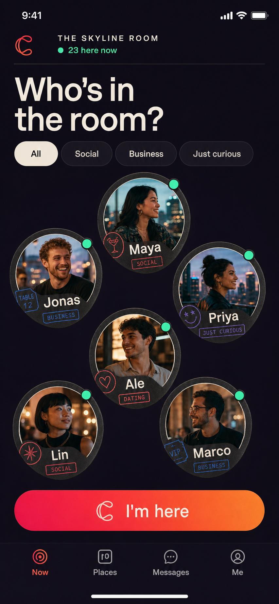
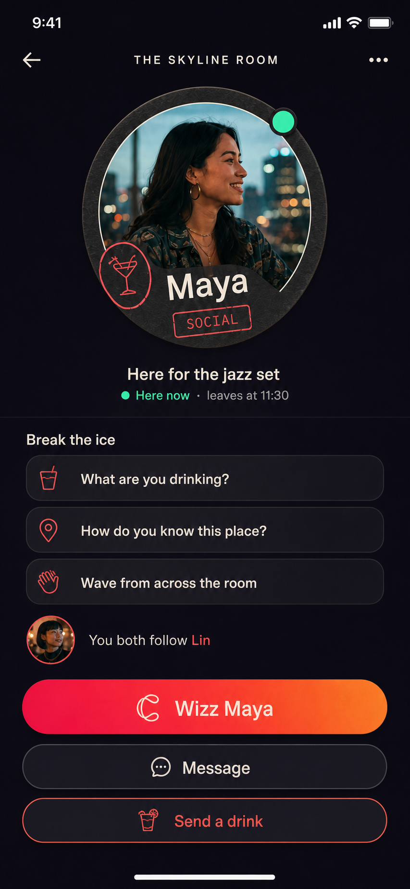
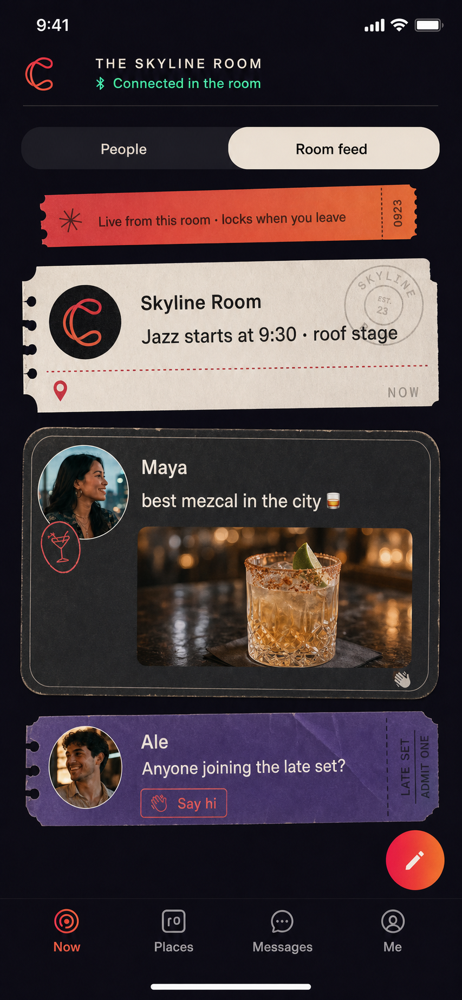
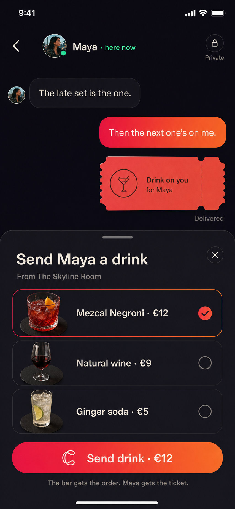
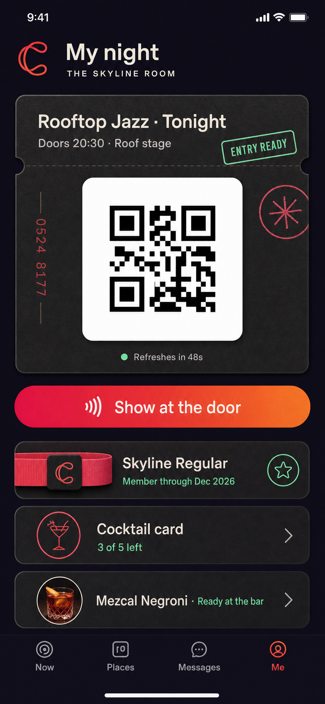

# Crays Mobile — Product Requirements Document

**Status:** Product concept 
**Platform:** React Native for iOS and Android 
**Working name:** `crays-rn` 
**Date:** 2026-08-02

> Crays is the social layer of real places: meet the people in the room, talk privately, order from the venue, and carry the tickets, passes, and memberships that make the night work.

## 1. Product summary

Crays Mobile is a place-first Nostr app for hospitality and events. It replaces the global, infinite social feed with a contextual experience centered on the venue the person is physically visiting.

A participating venue advertises a signed room descriptor and short-lived access challenge over Bluetooth. Crays discovers it, asks the person to join, and connects to the venue's Nostr relay. Inside that room, the person can:

- see people who have deliberately made themselves visible;
- read and post to a feed that belongs only to that place;
- send a low-pressure “Wizz” before opening a private conversation;
- order from the venue menu for themselves;
- buy someone in the room a drink;
- join an event, present a ticket, or use a pass;
- check membership status and remaining uses.

When the person leaves, the live room and its feed lock. Direct messages, purchased items, passes, memberships, and tickets remain available.

### Product thesis

Most social apps show people who are somewhere else. Crays helps with the room a person is already in.

### The memorable loop

**Walk in → join the room → notice someone → Wizz → talk → send a drink → meet.**

Commerce and access are not separate utilities bolted onto the social product. They give people natural reasons to interact and give the venue a reason to run the room.

## 2. Evidence and product lineage

This PRD is based on:

- the current [Crays website](https://crays.life), including “Meet the people in the room,” “First contact, zero awkward,” and “Order, book, pay — without leaving the moment”;
- the existing `/root/code/crays` repository and its Crays brand system;
- the hospitality admin surfaces in `/root/code/crays/src/routes/admin` and `/root/code/nuts-cash/src/routes/admin`;
- the member-side commerce, event, invite, and entitlement work in `/root/code/nuts-rn`.

There is no `/root/code/nuts` checkout on the host used for this PRD. `/root/code/nuts-cash` was treated as the intended staff/admin reference.

## 3. Product principles

1. **The room comes first.** The default social context is the place a person has intentionally joined, not a global algorithmic timeline.
2. **Presence is volunteered, not inferred.** Bluetooth discovers a venue. It does not publish a person, reveal exact distance, or continuously track them.
3. **First contact should feel light.** A Wizz, prompt, or drink is easier to answer than an unsolicited paragraph.
4. **Private conversation outlives the room.** The room is temporary; relationships belong to the people involved.
5. **The venue runs one operational truth.** Mobile orders, tickets, memberships, and passes must match the existing Crays/Nuts admin data and status flows.
6. **Protocols stay backstage.** Nostr, relays, Cashu, and signed events provide ownership and interoperability, but the primary UI speaks about rooms, people, tickets, drinks, and messages.
7. **Leaving must be real.** Live presence ends, posting locks, and the place feed is no longer browseable when proximity proof expires.

## 4. Users and jobs

### Guest or regular

At a bar, café, restaurant, club, hotel, coworking lounge, gym, or event, the guest wants to understand what is happening, meet people without a cold approach, order without breaking the moment, and find their ticket or pass quickly.

### Event attendee

The attendee wants to discover the room, see who else is attending, enter with a reliable QR, and keep conversations made there.

### Venue regular or member

The regular wants one place for membership status, benefits, passes, remaining uses, events, and a relationship with the venue.

### Venue staff and operator

Staff do not use this mobile app to run operations. They continue using the Crays/Nuts admin software for People, Events, Store/Menu, Orders, Invites, roles, payments, and settings. The mobile product is the guest side of those same objects.

## 5. Scope

### MVP

- Nostr identity onboarding and profile.
- Foreground Bluetooth discovery of nearby Crays rooms.
- Signed venue verification and explicit join/leave.
- Venue-scoped presence with visibility and intent controls.
- People view and first-contact Wizz.
- Place-locked room feed with venue and guest posts.
- Encrypted direct messages.
- Venue menu, self-order, and order status.
- “Send a drink” from a profile or conversation.
- Venue events, RSVP, capacity messaging, and entry ticket.
- Memberships, multi-use passes, remaining uses, and presentation QR.
- Notifications for Wizzes, accepted conversations, gifted items, orders, tickets, and passes.
- Blocking, reporting, venue moderation, and emergency leave controls.

### Explicit non-goals

- A global or algorithmic feed.
- Public follower-growth mechanics, influencer tools, or engagement streaks.
- Exact indoor location, distance-to-person, or a floor-plan tracker.
- Staff order management in the mobile app.
- Anonymous drink gifts.
- Dating matching, swiping, popularity scores, or “hot or not” mechanics.
- Claiming that place-locked content is copy-proof or screenshot-proof.

## 6. Information architecture

The compact-width app has four primary destinations:

| Destination | Purpose |
| --- | --- |
| **Now** | Discover and join a nearby room. Once joined: switch between People and Room feed, open the menu, or leave. |
| **Places** | Saved communities, upcoming events, venue details, menus, and membership offers. |
| **Messages** | Encrypted direct conversations and Wizz requests. This remains useful after leaving. |
| **Me** | Profile, privacy, orders, tickets, passes, memberships, payment methods, keys, and settings. |

### Active-room navigation

Within **Now**, the venue header remains pinned and shows connection state. The primary switch is:

- **People** — visible guests and staff who opted in;
- **Room feed** — posts from this venue session.

The header also exposes **Menu**, **My night**, and **Leave room** through direct actions or a compact venue sheet. Menu is never buried under profile settings.

### Outside a room

The Now screen explains the value before requesting Bluetooth permission. It then shows nearby signed venues, signal confidence as a neutral “Nearby” state, and a manual QR/deep-link fallback. It never shows meters or a precise location.

## 7. Core experiences

### 7.1 Join a room

1. The person opens Now.
2. Crays explains that Bluetooth finds participating rooms nearby and does not publish presence.
3. The person grants Bluetooth/Nearby Devices permission.
4. A signed venue card appears with name, image, current event, and what joining shares.
5. The person chooses **Join room**.
6. The app connects and authenticates to the advertised Nostr relay.
7. Before becoming visible, the person chooses:
   - visibility: **Visible** or **Browse quietly**;
   - intent: **Social**, **Business**, **Dating**, or **Just curious**;
   - optional one-line context, such as “Here for the jazz set”;
   - an automatic leave time.
8. Now opens on People. A persistent state reads **Connected in the room**.

Joining a relay never silently publishes visibility. Browse quietly remains a valid full-product state: the person can read venue announcements, order, and use a ticket without appearing to others.

### 7.2 People in the room

The People view is an organic constellation rather than a ranking. It may visually echo coasters on a table, but must preserve predictable reading order and accessibility semantics.

Each visible person shows only:

- chosen first/display name and avatar;
- chosen intent;
- optional one-line context;
- a live presence dot;
- mutual context when useful, such as a shared contact or shared event.

It does not show exact distance, table number, last active time outside the room, follower count, or a popularity score.

Filters affect only the local view. There is no public count of how often someone is opened or Wizzed.

### 7.3 Wizz and first contact

A **Wizz** is a lightweight invitation to interact. It is not an unrestricted DM.

- The sender chooses a short prompt or writes up to 120 characters.
- The recipient sees the sender's room profile and can **Wave back**, **Message**, **Not now**, **Block**, or **Report**.
- A recipient can limit Wizzes to mutual contacts, selected intents, or nobody.
- Rate limits apply per sender, recipient, and room.
- Repeated ignored Wizzes are suppressed.
- Once accepted, an encrypted direct-message thread opens and persists after both people leave.

The UI may offer prompts such as “What are you drinking?”, “How do you know this place?”, and “Wave from across the room.” The prompts should feel situational, not scripted as pickup lines.

### 7.4 Room feed

The Room feed is the only feed in Crays Mobile.

- It belongs to the currently joined venue relay.
- Live read and write access require a valid, recent room credential.
- Venue announcements, event updates, questions, photos, and lightweight social posts share one chronological stream.
- Posts identify the venue context clearly.
- The default view is concise: no engagement leaderboard, repost race, or recommendation algorithm.
- Available actions are reply, wave, report, and start a private conversation when allowed.
- Venue operators can pin one operational announcement, such as a stage time or kitchen closure.
- Guests can choose whether a room post may be saved to their own device.

#### Locking behavior

When proximity proof expires:

- new room posts stop loading;
- compose, reactions, and replies lock immediately;
- the screen changes to a clear **Room ended** state;
- private messages remain;
- the person's own room posts remain available in a private activity log only if they opted to save them;
- venue-issued orders, passes, tickets, and memberships remain available.

“Place-locked” is an access and product rule, not DRM. A person who saw a post can still remember, copy, photograph, or republish it. The onboarding copy must say that plainly without making the experience alarming.

### 7.5 Order from the venue

The active venue exposes its admin-managed menu/catalog. Hospitality venues use section-first navigation such as Cocktails, Wine, Food, and Soft drinks.

The order flow is:

1. Open Menu from the room header.
2. Choose an available item and quantity.
3. Choose **For me** or **Send to someone**.
4. Confirm fulfillment location only when the venue needs it, such as a table number or pickup point.
5. Pay with the configured venue checkout; Lightning/Cashu can be available without becoming the only path.
6. Receive live status: **Sent**, **Accepted**, **Preparing**, **Ready**, **Served**, or **Cancelled**.

The mobile labels map to the existing admin order ladder: `pending → accepted → processing → ready → fulfilled`, with `cancelled` as the terminal failure state.

### 7.6 Send someone a drink

**Send a drink** is available from a visible room profile and an established direct conversation.

1. Crays opens the current venue's eligible drink catalog.
2. The sender chooses an item and pays.
3. The venue receives a normal order with the recipient attached.
4. The recipient receives an encrypted message and a claim/presentation ticket.
5. The order progresses through the same kitchen/bar status flow.

Rules:

- The recipient must be a known Nostr identity currently in the room or an existing contact.
- The gift is never anonymous.
- The recipient can decline before fulfillment.
- Declining does not disclose their table or precise position.
- Refund behavior follows the venue's configured payment policy.
- Alcoholic items respect venue and jurisdiction rules; the venue remains responsible for age and service checks.

The feature should read as a social gesture, not a cash transfer. The primary copy is: **The bar gets the order. Maya gets the ticket.**

### 7.7 Events and entry

Places and the active room show venue events created by staff. An event may be free, RSVP-only, capacity-gated, membership-gated, or paid.

Guests can:

- view time, location, host, capacity, and access requirements;
- RSVP going, interested, or declined;
- purchase an entrance entitlement when required;
- open **My night** from Now or Me;
- present a short-lived signed QR at the door;
- see successful entry and any remaining event privileges.

The QR always sits on a pure white card for scanner contrast, regardless of theme. It refreshes automatically and exposes no Nostr implementation details.

### 7.8 Memberships and passes

Memberships and multi-use passes are first-class objects in Me and on the venue page.

Each item shows:

- issuer/venue;
- status: active, exhausted, expired, revoked, or action needed;
- validity period;
- remaining uses when finite;
- benefits or access scope;
- a live presentation QR;
- fulfillment activity, such as check-ins or redeemed drinks.

At-venue access must be reachable in two taps from a cold open when a relevant entitlement exists.

### 7.9 Leaving

The person can leave explicitly at any time. Crays also ends presence after the selected time or when the short-lived proximity credential can no longer be renewed.

Leaving:

- removes the person from the live room roster after a brief network tolerance window;
- locks the feed;
- stops Bluetooth scanning unless the person returns to Now;
- retains DMs, orders, tickets, passes, memberships, receipts, blocks, and reports;
- never sends a social “left the room” announcement.

## 8. Bluetooth room discovery and relay access

### Role of Bluetooth

Bluetooth is a discovery and proximity channel, not the transport for the Nostr feed. The venue advertises a compact room identifier and rotating challenge. Crays uses that to retrieve and verify a signed room manifest, then connects to the advertised relay over WebSocket.

This avoids trying to fit a full relay URL and metadata into a small advertisement and keeps normal Nostr networking intact.

### Proposed handshake

1. A venue gateway advertises the Crays service UUID, a short room ID, manifest version, and rotating nonce.
2. The app reads the signed manifest from a BLE GATT characteristic or a resolver named by the short room ID.
3. The app verifies that the manifest was signed by the venue/community identity already trusted by its Nostr community profile.
4. The manifest supplies relay URL, venue metadata hash, access policy, expiry, and challenge parameters.
5. After explicit join, the app signs an authentication event and proves knowledge of the rotating challenge.
6. The relay accepts live-room subscriptions and writes only while the credential is valid.
7. The app renews the credential while the venue signal remains available; loss of renewal moves through **Signal weak → Reconnecting → Room locked**.

NIP-42 should be used for relay authentication where compatible. The exact token binding and custom event kind remain an implementation decision and must receive a focused protocol/security review before build.

### Security properties

- Signed manifests prevent a nearby device from casually impersonating a known venue.
- Rotating challenges limit replay and remote sharing.
- Relay authentication binds access to the user's Nostr identity.
- Short expiry limits stale presence.
- A visible venue identity and manual join prevent silent room entry.

### Honest limitations

- A nearby attacker can relay Bluetooth traffic in real time; this is proximity gating, not high-assurance physical access control.
- Content already delivered cannot be revoked from a hostile client.
- Bluetooth background behavior differs across iOS and Android.
- Physical entry must continue to rely on signed, short-lived ticket/pass presentation rather than BLE presence alone.

### Platform behavior

- Scan only while Now is visible or during a short user-initiated join window.
- Request Bluetooth permission just in time and explain the benefit first.
- Avoid requesting precise location where the OS permits Bluetooth scanning without it.
- Provide QR/deep-link join as an accessibility, compatibility, and recovery fallback.
- When several venue beacons are present, show verified venue cards rather than auto-selecting the strongest signal.

## 9. Nostr and commerce model

Crays Mobile should reuse existing protocol objects rather than inventing parallel app-only records.

| Product concept | Existing substrate |
| --- | --- |
| Identity and profile | Nostr identity and kind `0` profile |
| Community/venue | Venue relay plus community profile and relay metadata |
| Events | Calendar events kinds `31922` / `31923`; RSVP kind `31925` |
| Product, pass, membership, ticket definition | Addressable badge definition kind `30009` with type/topic tags |
| Ownership/purchase award | Badge award kind `8` |
| Order/check-in state | Addressable status kind `37237`; readers may retain legacy `27237` compatibility during migration |
| Entry or entitlement presentation | Short-lived signed presentation kind `27236` |
| Direct messages | Encrypted Nostr messaging; choose the current supported standard during technical design |
| Room presence | New short-lived, venue-scoped signed event; kind and retention policy TBD |
| Room feed | Venue-relay posts with explicit room/community context and expiration policy; exact event shape TBD |

The current staff software remains authoritative for catalog availability, prices, membership offers, events, order progression, check-ins, roles, and invites.

### Admin-to-mobile mapping

| Staff admin area | Mobile outcome |
| --- | --- |
| Dashboard / community profile | Venue identity, room header, description, image, menu and booking links |
| People / roles | Trusted staff labels, member roles, moderation authority |
| Events | Place events, RSVP, capacity, access requirements, tickets |
| Store / Menu | Products, drinks, food, passes, and paid memberships |
| Orders & kitchen | Guest order and gifted-drink statuses |
| Invites | Join links and membership onboarding |
| Payments | Checkout availability and venue payout configuration |

The admin product needs one new setup area for the venue gateway: beacon health, signed manifest, room policy, feed retention, moderation defaults, and a printable QR fallback.

## 10. Privacy, trust, and safety

### Privacy defaults

- Joining a room and becoming visible are separate choices.
- Browse quietly is always available.
- Presence carries an expiry and is not written to global relays.
- Exact signal strength, distance, table, and movement are never shown to guests.
- Profile fields shown in-room are explicitly selected by the person.
- The app does not build a central history of venues visited.
- Analytics use aggregated operational events and never publish a person's venue history.

### Safety controls

- One-tap block and report from profile, Wizz, post, and message.
- Venue-scoped block plus global block.
- Wizz rate limits and recipient controls.
- No anonymous gifts.
- Staff moderation powers derive from trusted venue roles.
- Clear “Leave room and hide me” emergency action.
- A blocked person cannot Wizz, message, gift, or resolve live presence.
- Reports preserve the minimum signed evidence needed for review and explain who receives it.

### Accessibility

- Minimum 48×48 dp touch targets.
- Screen-reader order must be logical even when portraits use a visual constellation.
- Intent and status never rely on color alone.
- Support system text scaling without clipping venue actions or ticket state.
- Honor Reduce Motion; replace orbit/pulse motion with state changes.
- QR has a white quiet zone and an optional brightness boost.
- Haptics and sound are supplementary, never required.

## 11. Visual and interaction direction

### Design thesis

Crays should feel like the objects that pass between people and staff during a night out: a coaster, wristband, cloakroom stamp, receipt, menu, and ticket. This gives the app a tactile social vocabulary without imitating a dating app or a generic dark fintech wallet.

### Brand system

- **Base:** near-black aubergine `#10090E` and raised surface `#1A1017`.
- **Primary:** Crays raspberry `#F50A48` moving into aperitivo tangerine/coral `#FF7668` for singular actions.
- **Live/presence:** mint green reserved for verified connection and ready states.
- **Text:** warm off-white `#FFF4F5`; muted rose-gray for secondary copy.
- **Typography:** Suisse-style grotesk for all functional text. Marker lettering appears only as short human annotations and stamps.
- **Shape:** large native controls; irregular ticket/coaster silhouettes for authored content; standard predictable shapes for settings, permissions, and destructive decisions.
- **Material:** subtle paper, rubber, and woven-band texture. Avoid glassmorphism as the default container.
- **Motion:** one room-arrival sequence, gentle presence pulses, ticket tear/container transforms, and purposeful status movement. Never make portraits continuously drift while someone is trying to tap them.

### Voice

Short, direct, playful, and grounded in the venue:

- **Connected in the room**
- **Who's in the room?**
- **Wizz Maya**
- **Live from this room · locks when you leave**
- **The bar gets the order. Maya gets the ticket.**
- **Show at the door**

Avoid protocol jargon, hype, “community engagement,” and faux-intimate copy.

## 12. Concept screens

These are synthetic direction-setting mockups, not implemented UI. Names, venues, products, prices, events, and QR payloads are illustrative and must be replaced with real data. The QR shown is not a production credential.

### 01 — People in the room

The default connected state. Guest portraits behave like coasters spread across a table, while filters and semantics remain predictable.

### 02 — First hello

A person profile supplies just enough context to approach them and offers Wizz, private message, and drink actions without turning the room into a dating swipe deck.

### 03 — Place-locked Room feed

The feed is visibly attached to the current room. The People/Room feed switch keeps the social model coherent, and the lock promise is part of the interface rather than a hidden privacy policy.

### 04 — Direct message and send a drink

The current venue menu enters the private conversation as a native sheet. The venue receives an ordinary order; the person receives a claim ticket.

### 05 — My night

Tickets, memberships, passes, remaining uses, and order status meet in one venue-ready surface. The entry QR is dominant and scanner-safe.

## 13. Key states and failure handling

| Situation | Required behavior |
| --- | --- |
| Bluetooth denied | Explain the consequence, offer Settings and QR/deep-link fallback, preserve Places/Messages/Me. |
| No nearby room | Show saved places and upcoming events; do not fabricate nearby people. |
| Multiple rooms nearby | Show verified venue cards and ask the person to choose. |
| Unverified or changed manifest | Block automatic join and show a clear venue verification warning. |
| Relay offline | Keep ticket/pass data available locally where safely cached; room presence and feed show offline. |
| Signal temporarily lost | Show Signal weak, retain state briefly, retry, then lock; never silently keep the person visible indefinitely. |
| User leaves | Lock feed, remove presence, retain DMs and entitlements. |
| Empty room | Explain browse quietly and invite the person to be first visible; show venue announcement/menu/event utility. |
| Wizz declined | Confirm privately to the sender without exposing a reason. |
| Gift declined | Stop fulfillment when possible and follow venue refund policy. |
| Payment succeeds but app closes | Recover the order from the venue/payment reference and never ask the person to pay twice. |
| QR cannot refresh | Continue showing last-known entitlement state with explicit offline/error copy; do not present an expired code as valid. |
| Order cancelled | Show cancellation reason when provided and the venue's support/refund path. |

## 14. Notifications

High-value notifications only:

- Wizz received;
- Wizz accepted / message received;
- drink or item gifted;
- order accepted, ready, served, or cancelled;
- event starting soon;
- ticket or pass action needed;
- membership expiring or payment action needed.

Room-feed posts do not generate push notifications by default. Venue operators may send one pinned operational update per active event window, subject to user control.

## 15. Success measures

Targets should be established during pilot; the following define what to measure, not current claims:

- time from opening Now to joining a verified room;
- percentage of room joins that intentionally enable visibility;
- Wizz sent → accepted → first message conversion;
- conversations that continue after the room ends;
- room-feed readers and contributors per active venue session;
- menu open → paid order conversion;
- gifted drink acceptance and fulfillment rate;
- order recovery rate after interrupted checkout;
- successful ticket/pass scans and median time at the door;
- presence that expires correctly after leaving;
- blocks/reports per active room and staff resolution time;
- Bluetooth discovery failure and false-room selection rate.

The north-star outcome is **meaningful venue sessions**: a verified room join followed by at least one intentional action such as a Wizz, accepted conversation, room post, order, RSVP, or entitlement use. Raw screen time is not a goal.

## 16. Delivery sequence

### Phase 0 — Protocol and venue pilot

- Define signed room manifest and rotating BLE challenge.
- Threat-model relay access, replay, spoofing, and moderation.
- Build a venue gateway prototype and admin health/setup page.
- Validate iOS and Android foreground discovery in dense multi-venue environments.
- Confirm room feed/presence event shapes and retention.

### Phase 1 — The room

- Identity and profile.
- Join/leave and browse quietly.
- People, visibility, intents, Wizz, block/report.
- Room feed with lock states.
- Encrypted messages.
- Pilot telemetry and safety operations.

### Phase 2 — The whole night

- Venue menu and self-order.
- Send a drink.
- Live order status.
- Events, RSVP, entry ticket.
- Membership and pass surfaces.
- Offline/recovery hardening.

### Phase 3 — Repeat relationship

- Saved places and upcoming events.
- Membership renewal and venue benefits.
- Better mutual context and consent controls.
- Multi-venue operations, gateway fleet health, and moderation tooling.

## 17. MVP acceptance criteria

The MVP is ready for a real hospitality pilot when:

1. A new user can create or import a Nostr identity and understand key recovery.
2. A user can discover a signed venue over Bluetooth, inspect what joining shares, and join explicitly.
3. Browse quietly never publishes presence.
4. A visible user appears only on that venue's roster and expires after leaving or credential timeout.
5. The app never shows exact distance or movement of another guest.
6. People and Room feed are clearly two views of the same active venue.
7. Live feed read/write locks when the room credential expires.
8. A user can Wizz; the recipient can accept, ignore, block, or report.
9. Accepted users can continue an encrypted conversation after leaving.
10. Staff can publish a venue announcement and moderate a room post through trusted admin roles.
11. A user can purchase an available menu item and see every relevant admin status transition.
12. A user can send a non-anonymous venue item to another eligible person and the recipient can decline.
13. Interrupted checkout recovers without duplicate payment.
14. An attendee can find and present a short-lived event QR within two taps.
15. A pass shows correct remaining uses after staff fulfillment.
16. The venue admin can manage the same product/event/order records without a parallel mobile-only database.
17. Permission denial, relay outage, signal loss, expired QR, cancellation, and empty-room states are usable and tested.
18. Screen reader, text scaling, reduced motion, contrast, and 48 dp touch-target checks pass on both platforms.

## 18. Open decisions

- Final Nostr event kinds and tags for room presence, room posts, room credential proof, and feed expiration.
- Whether the BLE manifest is read directly over GATT, resolved through a directory, or supports both.
- Relay retention policy for guest room posts and staff announcements.
- Whether a user may retain a private local copy of room posts they authored.
- Payment methods and refund responsibility in each launch jurisdiction.
- Alcohol gifting eligibility and venue confirmation requirements.
- Whether Wizz is the final product term in every locale.
- Pilot venue hardware, power, network, and gateway maintenance model.
- Moderation evidence retention and operator escalation policy.
